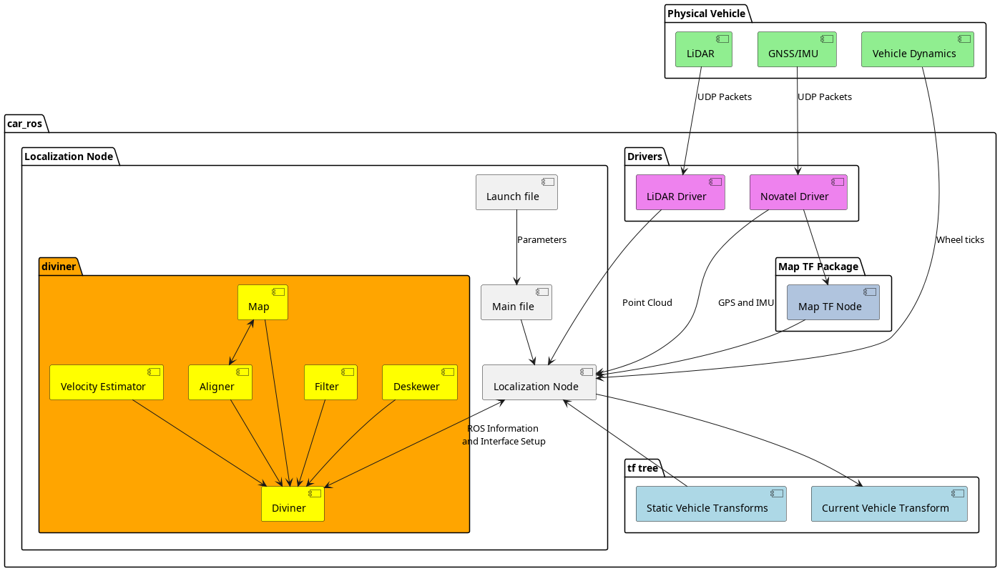

# Repo Under Construction #

This repo is still under construction and is not ready for use. Updates will happen periodically as changes are made. Please wait for updates to be made. If you'd like to see the original code, please see the original [Kiss-ICP repo](https://github.com/PRBonn/kiss-icp/tree/main), and its paper.

If you have any questions please reach out as I'd be happy to help. Thanks! :)

# Localization Node #

This repo contains the localization system and all of its code.
The localization system will act as the secondary positioning system within the car's stack. (redundancy)
The aim is to create a way to determine the car's location when standard gnss/inss positioning is unavailable or has a high positional error.

## Dependencies ##

List of packages used in this repo:

- roscpp
- std_msgs
- sensor_msgs
- pcl
- pcl_conversions
- tf2
- tf2_ros
- tf2_geometry_msgs
- nav_msgs
- tsl

## Node Setup ##

This node is built around the usage of [KISS-ICP](https://www.ipb.uni-bonn.de/wp-content/papercite-data/pdf/vizzo2023ral.pdf) which is a slam/localization method based on the usage of an iterative closest point (ICP) algorithm. 

chart needs to be updated with gnss, imu, and vehicle dynamics data.

### diviner ###

__Full Name:__ Diviner

Description: The Diviner is the main controller for the Localization system as just like a divining rod we hope to be able to locate water... wait no the end of the path...

#### Diviner Subsystems ####
MsgConverter - Message Converter

Converts incoming ROS pointclouds to the given data type used in the localization system.

### aligner ###

__Full Name:__ Aligner

Description: The aligner compares the current scan to the local map inorder to match our current position to the local scans. This makes it so that we can then add new data points to our current map using the mapper interface.

#### example_aligner ####

The example aligner is just a testing aligner for checking the software framework to make sure it runs and passes data properly. In this case the example aligner doesn't do much besides for passing data directly to the mapper.

#### pcl_aligner ####

Needs to be written

### deskewer ###

__Full Name:__ Deskewer

Description: The deskewer takes in point clouds and aims to lower the amount of movement based skewing that the vehicle adds to the system as it drives through its environment. For example, when looking at a 360 degree lidar on a vehicle, the scan pattern tends to be a spiral due to the rotation and longitudinal differences during the time of starting and ending the scan.

#### example_deskewer ####

The example deskewer is just a testing deskewer for checking the software framework to make sure it runs and passes data properly. In this case the example deskewer doesn't do much besides for passing data directly to the filters.

#### standard_deskewer ####

Needs to be written

### filter ###

__Full Name:__ Filter-er

Description: As per usual the Filter-er provides various filters that we can use for incoming point clouds. The main one of course being the voxel filter.The main goal is to subsample the lidar data points to lower the amount of data we are parsing through.

#### example_filter ####

The example aligner is just a testing aligner for checking the software framework to make sure it runs and passes data properly. In this case the example aligner doesn't do much besides for passing data directly to the mapper.

#### voxel_filter ####

The voxel filter filters stuff... (continue later)

#### dsor_filter ####

maybe a good idea to throw this one in there as an option if theres rain happening a lot... to be determined on a later date.

### mapper ###

__Full Name:__ Mapper

Description: The mapper does exactly as the name suggests; it maps! In full though it interacts with the map and each of the points from the voxel grids into the local map. In this case the map interface will exist as each of the ways that we're holding the map. As of the moment it will probably be held as a hash table but I'm leaving the option here as an interface so we can change down the line if needed. The map types will also be included as a piece of this interface as a secondary class (generally named with the word map at the end of the class name).

#### example_mapper ####

The example mapper is just a testing aligner for checking the software framework to make sure it runs and passes data properly. In this case the example mapper doesn't do much.

#### hash_mapper (not implemented) ####

Unlike how the name suggests, sadly the hash mapper does not actually map your weed. Instead it creates, edits and removes the information on the local map through the use of a hash table (hence the name). This hash table will be the way we create a map of our environment and better understand whats happening around us.

#### kdtree_mapper (not impletmeneted) ####

The kdtree mapper was our second plan for holding our localization map as it is a standard library within the spread of pcl allowing for easy communication between this and the pcl_aligner. However, due to the annoyance of not easily being able to add and remove points to a kdtree, we have opted to switch from this method to the octree_mapper (see below).

#### octree_mapper ####

The octree mapper is the suggested way to base the map of our local position on. Its also the only real and working version as this was deemed better than the previous two above. For the case of the octree, it allows us to easily add and delete points on the map, as well as subdivide each of the points within specific voxel grids of the surrounding area. Currently we are running on pcl's octree_pointcloud library as it is a simple way to base our stuff off of. The possible end goal is to make our own custom version but it is highly unlikely unless this for some reason doesn't work out for us.

### message converter ###

The message converter is the main location for conversion from ROS messages to various internal pointcloud types for data analyzation. This section in most packages (such as the perception node) is easily replaced by pcl's conversion functions but in this case cannot be. Due to the need for a relative timestamp, we needed to create a custom conversion section due to pcl not coming with a base point type with a timestamp. With the existence of this converter, we can however easily switch between different point types since we first convert to a custom cepton point where we then re-order data to match with the various point types we need.

__Current point types:__
- cepton point
- pclxyzi (we're re-purposing the intensity value to be our timestamp)

To add more point types, create a conversion from cepton points to the new point type inside of the [msg converter hpp](include/utils/msg_converter.hpp) and update the list here. 

### sync-er ###

message sync-er. may not be used

### vestimator ###

__Full Name:__ Velocity Estimator

Description: Estimates the velocity of the vehicle as it moves through the environment. In the current implementation we can use velocity estimation through wheel ticks, imu data, or assuming a constant velocity.

#### example_vestimator ####

The example vestimator is just a testing aligner for checking the software framework to make sure it runs and passes data properly. In this case the example vestimator doesn't do much besides for set a static velocity and pass it directly to the deskewer. Currently the static velocity is set to 0 in order to assume we're sitting in a static location.

#### constant_vestimator ####

The constant vestimator does exactly what it's name implies. By taking in the previous and current poses, it calculates the constant angular and linear velocities needed to get from the previous point to the current point in the time between each scan.

#### imu_vestimator ####

Needs to be written

#### wheel_tick_vestimator ####

Wheel go brrrrr -> each rotation gives a tick -> calculate tick rate to circumference of wheel -> get speed

### Inputs ###

__ROS Topics:__

| Name | Topic |
|--|--|
| point cloud topic | /cepton2/points_221339 |
| wheel ticks topic |  |
| gnss topic | /novatel/oem7/odom |
| imu topic | /novatel/oem7/corrimu |

__TF Frames__

| Frame |  |
|--|--|
| World | world |
| Map | map |
| Lidar | cepton |
| GNSS | gnss1 |
| Vehicle Base Link | base_link |

### Outputs ###

__ROS Topics__

| Name | Frequency | Topic | Category |
|--|--|--|--|
| Local Map Topic |  | /localization/local_map | Standard Topic |
| Deskewed Topic |  | /localization/deskewed_cloud | Debug Topic |
| Filtered Topic |  | /localization/filtered_cloud | Debug Topic |

__TF Frames__

| Frame |  |
|--|--|
| Vehicle Base Link |  |

## Current Work ##
__Currently unavailable for non-team related viewers.__ Look here to see current progress, future work needed, and other various things: [OpenProject Workpackages](http://141.219.248.68/projects/perception-1/work_packages?query_id=295)